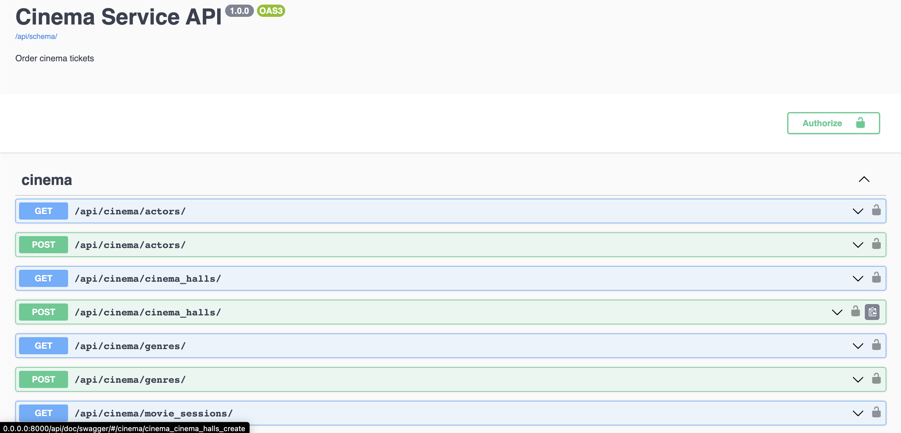
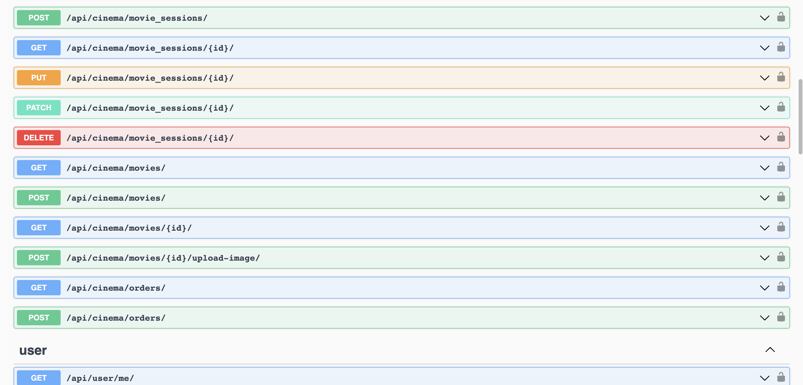
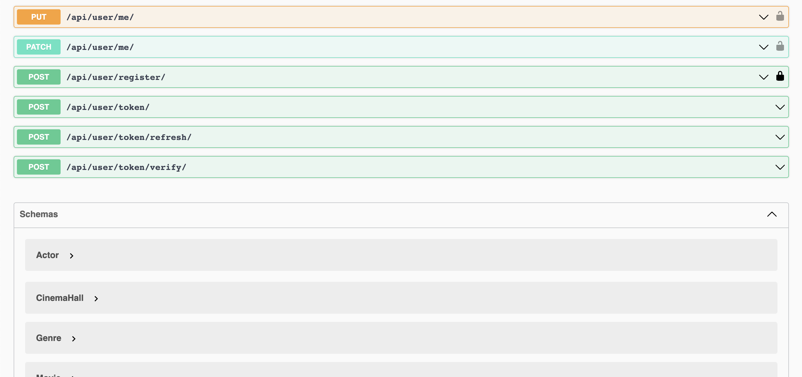

# Cinema API

---

API for Cinema management written in Django Rest Framework.

---


### Installation using GitHub:
```
git clone https://github.com/oigod/cinema-project.git
cd cinema-project
python3 -m venv venv
source venv/bin/activate(macOS, Linux)
venv\Scripts\activate(windows)
create .env by the example of .env.sample
python manage.py migrate
python manage.py runserver
```
---

### Run with Docker:
```
docker-compose build
docker-compose up
```

---

### Getting access:
+ create user via /api/user/register/
+ get access token via /api/user/token/


### Features:
+ User registration
+ User login
+ JWT authentication
+ Admin panel /admin/
+ Documentation /api/doc/swagger/
+ Managing orders and tickets
+ Managing movies with genres and actors
+ Creating cinema halls
+ Adding movie sessions
+ Filtering movies and movie sessions

---

### Demo:



